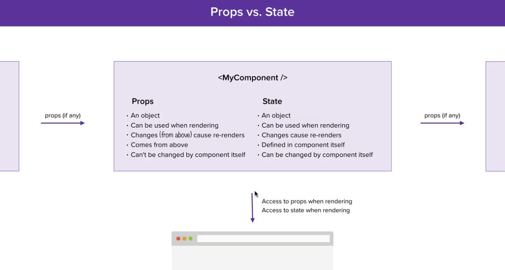
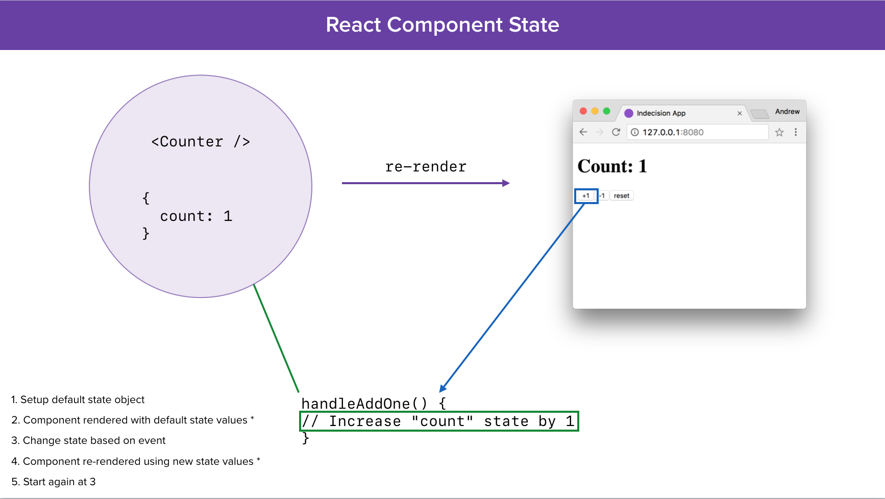
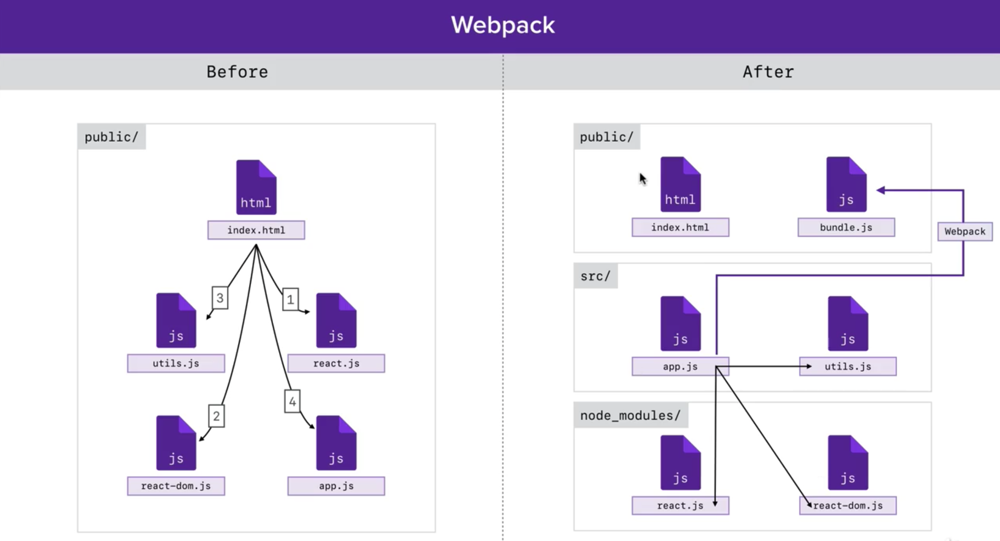

> markdown: https://guides.github.com/features/mastering-markdown/  
> Preview: Chrome extension and QuickLook / space key on the file 

React Course - Udemy - Andrew Mead - Part I
============================================
<!-- TOC -->

- [Setting up environment](#setting-up-environment)
- [Hello React](#hello-react)
- [JSX Basics](#jsx-basics)
- [JSX Comments](#jsx-comments)
- [JSX Expressions](#jsx-expressions)
- [JSX Conditional Rendering](#jsx-conditional-rendering)
  - [If statement](#if-statement)
  - [Ternary Operator](#ternary-operator)
  - [Logical and operator](#logical-and-operator)
  - [All together](#all-together)
- [Var vs. let/const](#var-vs-letconst)
- [Functions vs. Arrow functions - Syntax](#functions-vs-arrow-functions---syntax)
- [Functions vs. Arrow functions - Deep dive](#functions-vs-arrow-functions---deep-dive)
  - [arguments object](#arguments-object)
  - [this object](#this-object)
- [map function](#map-function)
- [Events and attributes](#events-and-attributes)
  - [Attributes](#attributes)
  - [Events](#events)
- [Manual Data Binding](#manual-data-binding)
- [Arrays](#arrays)
- [Forms, Inputs, Arrays and Random numbers](#forms-inputs-arrays-and-random-numbers)
- [React Virtual DOM readings](#react-virtual-dom-readings)
- [ES6 Classes](#es6-classes)
- [Subclasses](#subclasses)
- [React Components](#react-components)
  - [Nesting Components](#nesting-components)
  - [props](#props)
  - [Event handling](#event-handling)
  - [Method Binding](#method-binding)
- [State](#state)
  - [Setting up state](#setting-up-state)
    - [Example](#example)
- [Upstream communication](#upstream-communication)
- [Pass data upstream](#pass-data-upstream)
- [More than one state](#more-than-one-state)
- [Summary props vs state](#summary-props-vs-state)
  - [State](#state-1)
- [Stateless Functional Components](#stateless-functional-components)
  - [Comparison between Class based and Functional components - CC vs FC](#comparison-between-class-based-and-functional-components---cc-vs-fc)
- [Default props](#default-props)
- [Return an object from an arrow function using shorthand syntax](#return-an-object-from-an-arrow-function-using-shorthand-syntax)
- [Remove individual option](#remove-individual-option)
- [Lifecycle methods](#lifecycle-methods)
  - [componentDidMount](#componentdidmount)
  - [componentDidUpdate](#componentdidupdate)
  - [componentWillUnmount](#componentwillunmount)
- [LocalStorage](#localstorage)
- [Webpack](#webpack)
- [Changing project to use Webpack](#changing-project-to-use-webpack)
  - [Move away from using Global modules](#move-away-from-using-global-modules)
  - [Install and minimal setup webpack](#install-and-minimal-setup-webpack)
  - [ES6 import/export](#es6-importexport)
- [Import npm modules](#import-npm-modules)
- [Adding React via npm modules](#adding-react-via-npm-modules)
- [Setting up Babel with Webpack](#setting-up-babel-with-webpack)
- [One component per file](#one-component-per-file)
- [Source Maps with Webpack](#source-maps-with-webpack)
- [Webpack Dev Server](#webpack-dev-server)
- [ES6 class properties](#es6-class-properties)
- [Passing Children to Component](#passing-children-to-component)
- [React modal - Third party react component](#react-modal---third-party-react-component)
- [Styling our App](#styling-our-app)
  - [Setup webpack to include CSS files](#setup-webpack-to-include-css-files)
  - [Webpack and SCSS](#webpack-and-scss)
  - [Styling Header component](#styling-header-component)
  - [CSS reset](#css-reset)
- [Mobile considerations](#mobile-considerations)
- [favicon](#favicon)

<!-- /TOC -->

# Setting up environment
- Node, npm, yarn
  ```
  node -v / node --version
  npm -v  / npm --version
  yarn --version
  npm install -g yarn

  npm list -g --depth=0  //check modules installed globally
  npm config set prefix ~/npm  //check path for global modules  
  ```
- App  
  http://indecision.mead.io  
  https://github.com/andrewjmead/react-course-2-indecision-app

- VSC extensions
  - Sublime Text Keymap
  - Babel ES6/ES7
  - emmet (autocomplete - built-in VSC)
  - Path Intellisense

- Web Server  
  ```
  yarn global add live-server
  live-server -v
  live-server public (inside indecision-app folder)
  ```

# Hello React
- Using CDN
  ```
  <script src="https://unpkg.com/react@16.0.0/umd/react.development.js"></script>  
  <script src="https://unpkg.com/react-dom@16.0.0/umd/react-dom.development.js"></script>  
  (react-dom is specific for the browser, there's another for VR, native etc)
  ``` 
- JSX vs plain Javascript  
  Browsers do not understand JSX, tools like babel translates it
  - JSX   
    ```const template = <p id="my_p">This is JSX from app.js!</p>``` 
  - JavaScript (after babel using the web 'try it out') 
    ```javascript
    var template = React.createElement(
      "p",
      { id: "my_p" },
      "This is JSX from app.js!"
    );
    ```
  - install babel with presets: react and env (includes es2015, es2016 and es2017)   
    ```terminal
    yarn global add babel-cli@6.24.1
    yarn init
    yarn add babel-preset-react@6.24.1 babel-preset-env@1.5.2
    live-server public
    babel src/app.js --out-file=public/scripts/app.js --presets=env,react --watch 
    (manual process to compile src file)
    ```

# JSX Basics
- with JSX we can only have a single root element. (Usually a wrapper ```<div>```)
  ```terminal
  SyntaxError: src/app.js: Adjacent JSX elements must be wrapped in an enclosing tag (4:50)
  ```
- Some indentation and formatting technique ```(...);``` helps with clarity on the code. When this JSX in compiled, it uses nested React.createElement() calls to replicate the structure.
  ```javascript
  // JSX - JavaScript XML
  const template = (
    <div>
      <h1>Indecision App</h1>
      <p>This is some info</p>
      <ol>
        <li>Item one</li>
        <li>Item two</li>
      </ol>
    </div>
  );
  const appRoot = document.getElementById('app'); //better use getElementById for Ids 
                                                  //and querySelector with others selectors
  ReactDOM.render(template, appRoot);
  ```

# JSX Comments
  ```javascript
  {/* comments in JSX */}
  ```

# JSX Expressions
- To inject dynamic data into JSX templates we use expressions: ```{ }```. 
- We can render strings and numbers but not complete objects. We can use object properties though. (*a bit ahead but we can also render lists*)
  ```javascript
  const app = {
    title: 'Indecision App',
    subtitle: 'Are you feeling lucky?',
    items: ['Item one', 'Item two']
  };

  const template = (
    <div>
      <h1>{app.title}</h1>
      <p>{app.subtitle}</p>
      <ol>
        {app.items.map((element) => <li>{element}</li>)}
      </ol>
    </div>
  );
  const appRoot = document.getElementById('app');
  ReactDOM.render(template, appRoot);
  ```

# JSX Conditional Rendering
- To achieve conditional rendering we can combine truthy/falsy values with:
  - if statements
  - ternary operator (this is an expression not statement)
  - logical and operator ```(&&)```

## If statement  
- Calling a function is an expression but defining an if statement is not.
- Example: show location if it exists, otherwise show 'unknown'
  ```javascript
  const userName = 'Rocio Pena';
  const user = {
    age: 38,
    location: ''
  };
  const getLocation = () => user.location || 'Unknown' 
  const templateTwo = (
    <div>
      <h1>{userName.toUpperCase() + '!'}</h1>
      <p>Age: {user.age}</p>
      <p>Location: {getLocation()}</p>
    </div>
  );
  const appRoot = document.getElementById('app');
  ReactDOM.render(templateTwo, appRoot);
  ```
- JSX expressions can be used inside another JSX expression. e.g. ```{<h3>my h3</h3>}```. This is useful because we can set a function that returns a JSX expression, and call that function inside ```{}```.
- ```undefined``` is the implicit return from functions.
- If an expression resolves to ```undefined```, nothing will be shown. Not even empty or hidden tags. Same for ```true```, ```false``` and ```null```.
- Example: if there's no location, do not show the location ```<p>Location: Melbourne</p>```. Hide the paragraph tah all together.
  ```javascript
  const user = {
    name: 'Rocio',
    age: 38,
    location: ''
  };
  const getLocation = (location) => {
    if(location) {
      return <p>Location: {location}</p>
    } //this function returns location if exists or undefined
  }
  const templateTwo = (
    <div>
      <h1>{user.name}</h1>
      <p>Age: {user.age}</p>
      {getLocation(user.location)} //this will be undefined if location does not exist or it is empty
    </div>
  );
  const appRoot = document.getElementById('app');
  ReactDOM.render(templateTwo, appRoot);
  ```

## Ternary Operator
- ```true  ? 'Rocio' : 'Anonymous'``` // returns 'Rocio'
- ```false ? 'Rocio' : 'Anonymous'``` // returns 'Anonymous'
  ```javascript
  const user = {
    age: 38,
    location: ''
  };
  const templateTwo = (
    <div>
      <h1>{user.name ? user.name : 'Anonymous'}</h1>
      <p>Age: {user.age}</p>
    </div>
  );
  const appRoot = document.getElementById('app');
  ReactDOM.render(templateTwo, appRoot);
  ```

## Logical and operator
- ```true  && 'SomeAge' ``` // returns 'SomeAge'
- ```false && 'SomeAge' ``` // returns false
- If first operator is truthy, uses the second. If first operator is falsy, uses false.
- Example: show Age information only if user is 18 or older
  ```javascript
  const user = {
    age: 17,
    location: ''
  };
  const templateTwo = (
    <div>
      <h1></h1>
      {user.age >= 18 && <p>Age: {user.age}</p>}
      // if user.age >=18 uses second part
      // if user.age <18 expression evaluates to false and it's ignored
    </div>
  );
  const appRoot = document.getElementById('app');
  ReactDOM.render(templateTwo, appRoot);
  ```
- Condition can be more robust: ```{(user.name && user.age >= 18) && <p>Age: {user.age}</p>}```

## All together
  ```javascript
  const user = {
    name: 'Rocio',
    age: 20,
    location: 'Melbourne',
  };
  const getLocation = (location) => {
    if(location) {
      return <p>Location: {location}</p>
    } // return undefined if there's no location
  }
  const templateTwo = (
    <div>
      <h1>{user.name ? user.name : 'Anonymous'}</h1>
      {(user.age && user.age >= 18) && <p>Age: {user.age}</p>}
      {getLocation(user.location)}
    </div>
  );
  const appRoot = document.getElementById('app');
  ReactDOM.render(templateTwo, appRoot);
  ```

# Var vs. let/const
- ```var``` based variables are **function scoped**. That means that vars created inside an if statement are accessible outside the if statement.
- ```let``` and ```const``` based variables are **block level scoped**. They are accessible only inside the 'if' curly braces.
- As a good practice start all variables off as ```const``` and change it to ```let``` if needed. _var_ never :smirk:

# Functions vs. Arrow functions - Syntax
```javascript
// Named function
function square (x) {
  return x * x
}
console.log('Named function', square(2))

// Anonymous function
const square2 = function (x) {
  return x * x
}
console.log('Anonymous function', square2(5))

// Arrow function
const squareArrow = (x) => {
  return x * x
}
console.log('Arrow function', squareArrow(8))

// Arrow function with shorthand syntax
const squareArrow2 = (x) => x * x
console.log('Arrow function with shorthand syntax', squareArrow2(9))
```

# Functions vs. Arrow functions - Deep dive
## arguments object
```javascript
// arguments object - no longer bound with arrow functions
const add = function (a, b) {
  console.log(arguments) //38, 3, 100, ...
  return a + b
}
console.log(add(38, 3, 100)) //41

const add2 = (a, b) => {
  console.log(arguments) //error - can't find variable arguments
  return a + b
}
console.log(add2(38, 3, 100)) //not executed due to error
```

## this object
```javascript
// 'this' keyword - no longer bound
const user = {
  name: 'Rocio',
  cities: ['Colombia', 'Venezuela', 'USA', 'Australia'],
  printPlacesLived: function () {
    console.log(this.name) //Rocio
    console.log(this.cities) //["Colombia", "Venezuela", "USA", "Australia"]
    this.cities.forEach(function (city) {
    console.log(`${this.name} has lived in ${city}`)  // error, undefined is not an object
    })                                                // there's no bound 'this' value
  }
}
user.printPlacesLived();

// workaround
const user2 = {
  name: 'Rocio',
  cities: ['Colombia', 'Venezuela', 'USA', 'Australia'],
  printPlacesLived: function () {
    const that = this;
    //with an anonymous function, 'this' is not bound...as a workaround we use 'that' to preserve the context
    this.cities.forEach(function (city) {
      console.log(`${that.name} has lived in ${city}`) //expected output
    }) 
  }
}
user2.printPlacesLived();

// with arrow functions there's no need for any workaround
const user3 = {
  name: 'Rocio',
  cities: ['Bogotá', 'Valencia', 'Caracas', 'Chicago', 'Melbourne'],
  printPlacesLived: function () {
    //arrow functions no longer bind their own 'this' value
    //instead they just use the 'this' value of the context they were created in
    //uses its parent's 'this' value
    this.cities.forEach((city) => {
      console.log(`${this.name} has lived in ${city}`) //expected output
    })
  }
}
user3.printPlacesLived();

//an arrow function wouldn't work here because it will try to use the parent's this which is undefined
...
printPlacesLived: () => {
  this.cities.forEach((city) => {
    console.log(`${this.name} has lived in ${city}`)
  })
}
...
//we can use the new syntax though to make it clearer
...
const user4 = {
  name: 'Rocio',
  cities: ['Bogotá', 'Valencia', 'Caracas', 'Chicago', 'Melbourne'],
  printPlacesLived() { //using new es6 syntax
    this.cities.forEach((city) => {
      console.log(`${this.name} has lived in ${city}`) //expected output
    })
  }
}
user4.printPlacesLived();
...
```

# map function
- **map** is an array method extensively used with JSX
- Like the ```forEach``` method, ```map``` gets called with a single function, this function gets called one time for every item in the array and we have access to that item via the first argument
- ```forEach``` lets you do something with each element whereas with ```map``` we can actually transform each item
- We get a new array back with the transformed items 
- The original array doesn't get changed
  ```javascript
  const user5 = {
    name: 'Rocio',
    cities: ['Miami', 'Chicago', 'Buenos Aires', 'Mexico City', 'Sydney', 'Brisbane'],
    printPlacesLived() {
      const cityMessages = this.cities.map((city) => {
        return `${this.name} has visited ${city}`
      })
      return cityMessages
    }
  }
  console.log(user5.printPlacesLived());
  //output: ["Rocio has visited Miami", "Rocio has visited Chicago", "Rocio has visited Buenos Aires", 
  //"Rocio has visited Mexico City", "Rocio has visited Sydney", "Rocio has visited Brisbane"]
  ```
- Simplified syntax
  ```javascript
  const user6 = {
    name: 'Rocio',
    cities: ['Miami', 'Chicago', 'Buenos Aires', 'Mexico City', 'Sydney', 'Brisbane'],
    printPlacesLived() {
      return this.cities.map((city) => `${this.name} has visited ${city}`)
    }
  }
  console.log(user6.printPlacesLived());
  ```
- map challenge
  ```javascript
  // challenge
  const multiplier = {
    numbers: [8, 9, 5],
    multiplyBy: 2,
    multiply() {
      //the expression after => is implicitly returned
      return this.numbers.map((number) => number * this.multiplyBy)
    }
  }
  console.log(multiplier.multiply()) //output: [16, 18, 10]
  ```

# Events and attributes

## Attributes
- Adding attributes to HTML elements in JSX is as easy as adding them to an a regular html element. However, some attributes such as ```class``` have been renamed for JSX. In this particular case ```class``` is a reserved word to create classes in javascript.
- Similar thing happens with some other attributes: https://reactjs.org/docs/dom-elements.html. Many of them have also been renamed to camelCase.
  ```javascript
  let count = 0
  const templateTwo = (
    <div>
      <h1>Count: {count}</h1>
      <button id="my_id" className="button">+1</button>
    </div>
  );
  const appRoot = document.getElementById('app');
  ReactDOM.render(templateTwo, appRoot);
  ```
- In the end of the day ```templateTwo``` is just an object with ```type: "div"``` (root) and sub-elements are inside ```props.children```. In turn, each sub-element has the same structure: a type and its children (as nodes)

- An attribute can be set equal to a javascript expression, whatever results from the expression will be the value for the attribute.
  ```javascript
  let count = 0
  const someId = 'myidhere'
  const templateTwo = (
    <div>
      <h1>Count: {count}</h1>
      <button id={someId} className="button">+1</button>
    </div>
  );
  ```
  
## Events
- Expressions as the value for attributes are very useful for event handling.
  ```javascript
  let count = 0
  const addOne = () => {
    console.log('addOne')
  }
  const templateTwo = (
    <div>
      <h1>Count: {count}</h1>
      <button onClick={addOne}>+1</button>
    </div>
  );
  const appRoot = document.getElementById('app');
  ReactDOM.render(templateTwo, appRoot);
  ```
- We can also define the even handler inline. Better for short functions as it gets difficult to read and maintain.
  ```javascript
  let count = 0
  const templateTwo = (
    <div>
      <h1>Count: {count}</h1>
      <button onClick={() => {
        console.log('adding one')
        }}>+1
      </button>
    </div>
  );
  const appRoot = document.getElementById('app');
  ReactDOM.render(templateTwo, appRoot);
  ```

# Manual Data Binding
- JSX does not have built-in data binding
- Trying to update the counter in the previous example using the same code will not have effect in the view (HTML)
- The expression ```const templateTwo = ...``` runs before anything is rendered to the screen. ```count``` is zero and the buttons haven't even been registered with the event handler functions. The actual render happens when we call ```ReactDOM.render()```
  ```javascript
  let count = 0
  const addOne = () => {
    count++
    console.log('addOne', count)
  }
  const templateTwo = (
    <div>
      <h1>Count: {count}</h1> // this will always be zero
      <button onClick={addOne}>+1</button>
    </div>
  );
  const appRoot = document.getElementById('app');
  ReactDOM.render(templateTwo, appRoot);
  ```
- As a workaround we can move the template and rendering code to a function and call that function once when the page loads and then any time we change the data (**manual binding**). Later we'll use react components to do this.
  ```javascript
  let count = 0
  const addOne = () => {
    count++
    renderCounterApp() //re-render when data changes
  }
  const appRoot = document.getElementById('app')
  const renderCounterApp = () => {
    const templateTwo = (
      <div>
        <h1>Count: {count}</h1>
        <button onClick={addOne}>+1</button>
      </div>
    );
    ReactDOM.render(templateTwo, appRoot)
  }
  renderCounterApp() //initialize the App
  ```
- Rendering UI is very expensive but React makes the re-rendering super efficient. React uses virtual DOM algorithms to determine the portions on the screen that need to be updated and changes only that small little section. No even changing whole tags (such as ```<h1>```) but the text node that contains the counter in this example. What comes back from ```React.createElement()``` is just an object that represents our entire JSX tree. React uses algorithms to compare two objects which is way less expensive that re-painting pixels to the browser.

# Arrays
- JSX support arrays by default (as well as strings and numbers. Does not support objects and ignore booleans, null and undefined)
- When JSX sees an array it breaks each element out into their own expressions and shows them side by side
  ```javascript
  { [99, 98, 'Rocio'] } is equivalent to { {99}{98}{'Rocio'} } 
  { [null, undefined, true] } is equivalent to { {null}{undefined}{true} } //none will render
  ```
- We know we can also render JSX inside of JSX e.g ```{<p>My Paragraph</p>}``` and that will show up to the screen. In turn, we can render an array of JSX inside JSX. Most of the time we will not have arrays of numbers/strings to render to the screen but instead arrays of JSX expressions we want to render to the screen, for example an array of paragraphs or list items ```<li>```
  ```javascript
  { [<p>a</p>, <p>b</p>, <p>c</p>] }
  //will render as:
  //a
  //b
  //c
  ```
- With JSX inside arrays, we get an error: ```Warning: Each child in an array or iterator should have a unique "key" prop.``` and this is to help JSX to know when to re-render small parts of the application.
  ```javascript
  { [<p key="1">a</p>, <p key="2">b</p>, <p key="3">c</p>] }
  ```
- To display an array of elements as JSX code we use the map function
  ```javascript
  const numbers = [55, 101, 1000]
  
  //inside render function
  {
    numbers.map((number) => {
      return <p key={number}>Number: {number}</p>
    })
  }
  ```
  
# Forms, Inputs, Arrays and Random numbers
- Example below takes the input and add it to the options array. Also allow to remove all options and re-renders every time the data changes. Allows to pick a random option. Handle events onSubmit and onClick and shows conditional attribute disabled. 
- For a list of events: React Dom Events https://reactjs.org/docs/events.html
- Math.random() generates a number between 0 and 0.999999 [0,1). It can be zero but not 1.
  ```javascript
  const app = {
    title: 'Indecision App',
    subtitle: 'Are you feeling lucky?',
    options: []
  };

  const onFormSubmit = (e) => {
    e.preventDefault() //avoid re-rendering the whole page
    const option = e.target.elements.option.value //elements.option is by name
    if(option) { //no empty
      app.options.push(option)
      e.target.elements.option.value = '' //clear up the input field
      renderApp()
    }
  }

  const onRemoveAll = () => {
    app.options = [] //assign an empty array
    renderApp()
  }

  const onMakeDecision = () => {
    const randomNun = Math.floor(Math.random() * app.options.length)
    const option = app.options[randomNun]
    alert(option)
  }

  const appRoot = document.getElementById('app')

  const renderApp = () => {
    const template = (
      <div>
        <h1>{app.title}</h1>
        {app.subtitle && <p>{app.subtitle}</p>}
        <p>{app.options.length > 0 ? 'Here are your options' : 'No options'}</p>
        <button disabled={app.options.length === 0} onClick={onMakeDecision}>What should I do?</button> 
        {/* button is disabled when array is empty */}
        <button onClick={onRemoveAll}>Remove All</button> 
        {/*nothing to submit so no form associated*/}
        <ol>
          {app.options.map((option) => <li key={option}>{option}</li>)} {/*key is important*/}
        </ol>
        <form onSubmit={onFormSubmit}>
          <input type="text" name="option" />
          <button>Add Option</button>
        </form>
      </div>
    );
    ReactDOM.render(template, appRoot)
  }

  renderApp() //render App for the first time
  ```
  
# React Virtual DOM readings
- https://reactjs.org/docs/reconciliation.html
- https://medium.com/@gethylgeorge/how-virtual-dom-and-diffing-works-in-react-6fc805f9f84e
- https://www.youtube.com/watch?v=mLMfx8BEt8g

# ES6 Classes
- ```class``` was always a reserved word but until ES6 it wasn't useful
- By convention classes names start with uppercase ```class Person```
- Use the ```new``` keyword to create instances of the class ```const me = new Person()```
- Use the ```constructor``` function to set individual attributes. The constructor gets implicitly called when we crete a new instance of a class.
  ```javascript
  class Person {
    constructor(name) {
      this.name = name // customize individual instance of Person
    }
  }

  const me = new Person('Rocio')
  console.log(me)
  ```
- We don't have to pass all values to create an instance, it that case name will be undefined. ```const other = new Person()```
- We can also provide defaults in case the data is not specified. In the past it was done with a workaround using the logical OR operator
  ```javascript
  class Person {
    constructor(name) {
      this.name = name || 'Anonymous' //use the name if it exists otherwise use 'Anonymous'
    }
  }
  const other = new Person()
  console.log(other)
  ```
- With ES6 we have access to **function defaults**, these can be used anywhere we define an argument list 
  ```javascript
  class Person {
    constructor(name = 'Anonymous') { //function defaults
      this.name = name
    }
  }
  const other = new Person()
  console.log(other)
  ```
- Constructors take care of what makes each person unique. Now, the things each person shares are modelled using **methods** which allow us to reuse code across every instance of a Person. A method need to be explicitly called for it to run.
- :warning: Adding a comma between the constructor and methods or between methods is not allowed
- Methods are available to us on the individual instances of our class
  ```javascript
  class Person {
    constructor(name = 'Anonymous') {
      this.name = name
    } //no comma here to separate constructor from methods
    getGreeting() {
      return `Hi. I am ${this.name}!` //ES6 template strings
    }
  }
  const me = new Person('Rocio')
  console.log(me.getGreeting())
  ```

# Subclasses
- We can extend the class Person and that's going to give us all the Person's functionality and it's also going to allow us to override any of the functionality we might want to change. ES6 does not support multiple inheritance.
  ```javascript
  class Student extends Person {
    constructor(name, age, major) {
      super(name, age)  //calling the parent constructor
      this.major = major
    }
  }
  const me = new Student('Rocio', 38, 'Computer Science')
  const other = new Student()
  ```
- We can add new methods specific to the subclass
  ```javascript
  class Student extends Person {
    constructor(name, age, major) {
      super(name, age)  //calling the parent constructor
      this.major = major
    }
    hasMajor() {
      console.log(this.major) //string or undefined
      console.log(!this.major) //false if there's a string, true otherwise
      return !!this.major //returns boolean true if there's a string, false otherwise (instead of truthy, falsy)
    }
  }
  const me = new Student('Rocio', 38, 'Computer Science')
  console.log(me.hasMajor()) //true
  const other = new Student()
  console.log(other.hasMajor()) //false
  ```
- We can also override a method provided by the parent class
  ```javascript
  class Person {
    constructor(name = 'Anonymous', age = 0) {
      this.name = name
      this.age = age
    }
    getGreeting() {
      return `Hi. I am ${this.name}!`
    }
    getDescription() {
      return `${this.name} is ${this.age} year(s) old.`
    }
  }

  class Student extends Person {
    constructor(name, age, major) {
      super(name, age)  //calling the parent constructor
      this.major = major
    }
    hasMajor() {
      return !!this.major //returns boolean true if there's a string, false otherwise
    }
    getDescription() {
      let description = super.getDescription() //calling parent's method
      if(this.hasMajor()) {
        description += ` Their major is ${this.major}.`
      }
      return description
    }
  }

  const me = new Student('Rocio', 38, 'Computer Science') 
  console.log(me.getDescription()) //Rocio is 38 year(s) old. Their major is Computer Science.

  const other = new Student()
  console.log(other.getDescription()) //Anonymous is 0 year(s) old.
  ```
  
# React Components
- Components allow us to break up our App into small reusable chunks (think of it as UI sections)
- Each little component has its own set of JSX that React renders to the screen, it can handle events for those JSX elements and allow us to create these little self-contained units 
- A React Components is an ES6 class that extends from ```React.Component``` (Global we get when adding React to our project)
- React Components require the method ```render()``` to be defined. From this method we return the JSX for our Component
- To render a Component we still use ```ReactDOM.render``` passing the JSX template we want to render and the place inside the HTML where we want it to be shown
- Component classes must start with uppercase, React enforces this and it's a way to differentiate between regular HTML tags such as ```<h1></h1>``` and Components such as ```<Header />```. Using uppercase, the compiled code looks like ```React.createElement(Header, null)``` while with lowercase, it will try to render a 'header' HTML tag ```React.createElement('header', null),```. It's important to follow the convention, otherwise the Component will not render.
- React Component Example
  ```javascript
  class Header extends React.Component {
    render() {
      return (
        <div>
          <h1>Indecision</h1>
          <h2>Put your life in the hands of a computer</h2>
        </div>
      );
    }
  }
  const jsx = (
    <div>
      <Header />
    </div>
  )
  ReactDOM.render(jsx, document.getElementById('app'))
  ```

## Nesting Components
- React Components can render another components allowing us to nest components.
  ```javascript
  class Option extends React.Component {
    render() {
      return (
        <div>
          <p>&nbsp;&nbsp;&nbsp;&nbsp;&nbsp;Option component here</p>
        </div>
      );
    }
  }
  class Options extends React.Component {
    render() {
      return (
        <div>
          <p>Options component here</p>
          <Option /> {/* nesting */}
          <Option /> {/* reusing */}
        </div>
      );
    }
  }
  ```

## props
- Allow components to communicate with one another. With props we can establish one way communication between a Parent and a Child components
- Props are read-only
- Setting props is similar to setting key-value pairs in HTML attributes
- This is a way to make the Component more flexible and pass data as we need
- props names can be anything eg ```<Header title="Test Title">```
- We use ```this.props``` to get access to data passed down to the Component
  ```javascript
  class IndecisionApp extends React.Component {
    render() {
      return (
        <div>
          <Header title="Test Title"/>
        </div>
      );
    }
  }

  class Header extends React.Component {
    render() {
      console.log(this.props)  {/* {title: "Test Title"} */}
      return (
        <div>
          <h1>{this.props.title}</h1>
          <h2>Put your life in the hands of a computer</h2>
        </div>
      );
    }
  }
  ```
- We can also set variables with data we want to pass in. Any Javascript code must be before the return statement or inside a JSX expression
  ```javascript
  class IndecisionApp extends React.Component {
    render() {
      const title = 'Indecision'
      const subtitle = 'Put your life in the hands of a computer'
      return (
        <div>
          <Header title={title} subtitle={subtitle}/>
        </div>
      );
    }
  }

  class Header extends React.Component {
    render() {
      return (
        <div>
          <h1>{this.props.title}</h1>
          <h2>{this.props.subtitle}</h2>
        </div>
      );
    }
  }
  ```
- Collection of elements can also get passed between components
  ```javascript
  class IndecisionApp extends React.Component {
    render() {
      const options = ['thing one', 'thing two', 'thing four']
      return (
        <div>
          <Options options={options} />
        </div>
      );
    }
  }

  class Options extends React.Component {
    render() {
      return (
        <div>
          {/* map returns a new array with all elements changed to be now <p> tags whose key and value are the option text*/}
          {
            this.props.options.map((option) => <p key={option}>{option}</p>)
          }
        </div>
      );
    }
  }
  ```
- We can keep on passing data as props from component parent to children. From ```<IndecisionApp />``` to ```<Options />``` to ```<Option />```
  ```javascript
  class IndecisionApp extends React.Component {
    render() {
      const options = ['thing one', 'thing two', 'thing four']
      return (
        <div>
          {/* <IndecisionApp /> passes options array to <Options /> */}
          <Options options={options} /> 
        </div>
      );
    }
  }

  class Options extends React.Component {
    render() {
      return (
        <div>
          {
            {/* <Options /> passes each optionText to <Option /> */}
            this.props.options.map((option) => <Option key={option} optionText={option} />)
          }
        </div>
      );
    }
  }

  class Option extends React.Component {
    render() {
      return (
        <div>
          {/* <Option /> uses the data to render the value passed from parent */}
          {this.props.optionText}
        </div>
      );
    }
  }
  ```

## Event handling
- We use methods inside each class to handle events associated to html elements rendered by such component. In this case onClick
  ```javascript
  class Action extends React.Component {
    handlePick() {
      alert('handlePick')
    }
    render() {
      return (
        <div>
          <button onClick={this.handlePick}>What should I do?</button>
        </div>
      );
    }
  }
  ```
- Submit Form
  ```javascript
  class AddOption extends React.Component {
    handleAddOption(e) { {/* gets called with the event */}
      e.preventDefault() {/* prevents default browser behavior - submit */}
      const option = e.target.elements.option.value.trim() {/* option here is the name of the input */}
      if (option) {
        alert(option)
      }
    }
    render() {
      return (
        <div>
          <form onSubmit={this.handleAddOption}>
            <input type="text" name="option" />
            <button>Add Option</button>
          </form>
        </div>
        
      );
    }
  }
  ```

## Method Binding
- https://developer.mozilla.org/en-US/docs/Web/JavaScript/Reference/Global_objects/Function/bind
- Javascript losses the ```this``` binding in certain situations
- We know this works
  ```javascript
  const obj = {
    name: 'Rocio',
    getName() {
      return this.name
    }
  }
  console.log(obj.getName()) //prints Rocio
  ```
- But this code breaks the binding. We can't get a reference to getName method. They both run the same code, the problem is that the context is different. ```obj.getName()``` is in the context of an object, so we have access to that object and the ```this``` binding. But when we break it out to a function we lose that context, the context does not get transferred. This is now a regular function and regular functions have undefined for ```this``` by default. This is not specific for React but instead all Vanilla Javascript, JQuery etc have this issue.
  ```javascript
  const getName = obj.getName //TypeError: undefined is not an object (evaluating 'this.name')
  console.log(getName())
  ```
- What we need to do is to set the ```this``` binding in certain situations. For this we can use the ```bind``` method available on functions in Javascript. In the first argument we can pass the ```this``` context
  ```javascript
  const obj = {
    name: 'Rocio',
    getName() {
      return this.name
    }
  }
  const getName = obj.getName.bind(obj) //now it's bind 
  console.log(getName()) //prints Rocio
  ```
- We can actually pass anything we want as context
  ```javascript
  const getName = obj.getName.bind({ name: 'Rossy44'}) //changes the context
  console.log(getName()) // prints Rossyp44
  ```
- Event handling is one of those situations where Javascript loses the binding to ```this```
  ```javascript
  class Options extends React.Component {
    handleRemoveAll() {
      console.log(this.props.options) //TypeError: undefined is not an object (evaluating 'this.props')
      alert('handleRemoveAll')
    }
    render() {
      return (
        <div>
          <button onClick={this.handleRemoveAll}>Remove All</button>
          {
            this.props.options.map((option) => <Option key={option} optionText={option} />)
          }
        </div>
      );
    }
  }
  ```
- By doing this, we're doing ```handleRemoveAll()``` to have the same binding as ```render()``` does
  ```javascript
  class Options extends React.Component {
    handleRemoveAll() {
      console.log(this.props.options)
      alert('handleRemoveAll')
    }
    render() { //render is not an event handler so its binding is OK
      return (
        <div>
          <button onClick={this.handleRemoveAll.bind(this)}>Remove All</button>
          {this.props.options.map((option) => <Option key={option} optionText={option} />)}
        </div>
      );
    }
  }
  ```
- This technique works but it's a little inefficient, it requires us to rerun ```bind``` anytime the component re-renders and because components re-render often this can get a bit expensive
- A better approach is to override the constructor function for the React Component
  ```javascript
  class Options extends React.Component {
    constructor(props) { //gets called with props
      super(props) //important to do this
      this.handleRemoveAll = this.handleRemoveAll.bind(this) 
      //now the context is correct and we only have to do this once
    }
    handleRemoveAll() {
      console.log(this.props.options)
      alert('handleRemoveAll')
    }
    render() {
      return (
        <div>
          <button onClick={this.handleRemoveAll}>Remove All</button>
          {this.props.options.map((option) => <Option key={option} optionText={option} />)}
        </div>
      );
    }
  }
  ```

# State
- Component state allows our components to manage some data (object with various key-value pairs) and when that data changes the component will automatically re-render to reflect those changes 
- Previously (jsx-indecision) we manually called a render method every time we needed to update something on the screen. With component state all we have to do is manipulate the 
data and the component is gonna take care of re-rendering itself

## Setting up state
1. Setup default state object (object with variables in zero, empty arrays etc)
2. Component rendered with default state values (*)
3. Change state based on event (button click, network request ready etc)
4. Component re-rendered using new state values (*)
5. Start again at 3

(*) behind the scenes

### Example
- Step 1
  ```javascript
  class Counter extends React.Component {
    constructor(props) {
      super(props)
      //step1 - setting up default state object
      this.state = {
        count: 0
      }
    }
    ...
  }
  ```
- Step 2
  ```javascript
  render() {
    return (
      <div>
        {/* step2 - component rendered with default state values */}
        <h1>Count: {this.state.count}</h1>
        <button onClick={this.handleAddOne}>+1</button>
        <button onClick={this.handleMinusOne}>-1</button>
        <button onClick={this.handleReset}>reset</button>
      </div>
    );
  }
  ```
- Step 3
  ```javascript
  handleAddOne() {
    //step3 - change state base on event
    //we can't just update the this.state object instead we call this.setState method
    //first parameter is a function that returns the new state and we get access to the previous state
    this.setState((prevState) => {
      return {
        count: prevState.count + 1
      }
    })
  }
  ```
- Step 4 happens automatically after setting the new state
- When setting the new state we provide just the ones we need to change, the rest remain the same
- We might not need the previous state and that's also fine
  ```javascript
  handleReset() {
    //no previous state needed
    this.setState(() => {
      return {
        count: 0
      }
    })
  }
  ```
- React allows to pass an object to setState instead of a function and it might bring issues specially when the previous state is needed. There will be inconsistency in the result because setState is asynchronous. Even if we don't need the previousState the recommended way is to pass a function as React might deprecate the alternative.
- Complete Counter example
  ```javascript
  class Counter extends React.Component {
    constructor(props) {
      super(props)
      //assign to themselves but rebinding the context
      //bound to the correct component instance when the callback eventually fires
      this.handleAddOne = this.handleAddOne.bind(this)
      this.handleMinusOne = this.handleMinusOne.bind(this)
      this.handleReset = this.handleReset.bind(this)
      //step1 - setting up default state object
      this.state = {
        count: 0
      }
    }
    handleAddOne() {
      //step3 - change state base on event
      //we can't just update the this.state object instead we call this.setState method
      //first parameter is a function that returns the new state and we get access to the previous state
      this.setState((prevState) => {
        return {
          count: prevState.count + 1
        }
      })
    }
    handleMinusOne() {
      this.setState((prevState) => {
        return {
          count: prevState.count - 1
        }
      })
    }
    handleReset() {
      //no previous state needed
      this.setState(() => {
        return {
          count: 0
        }
      })
    }
    render() {
      return (
        <div>
          {/* step2 - component rendered with default state values */}
          <h1>Count: {this.state.count}</h1>
          <button onClick={this.handleAddOne}>+1</button>
          <button onClick={this.handleMinusOne}>-1</button>
          <button onClick={this.handleReset}>reset</button>
        </div>
      );
    }
  }
  ReactDOM.render(<Counter />, document.getElementById('app'))
  ```

# Upstream communication
- props enables one way communication from parent components to a child, but children can't pass props upstream. To solve this problem we're gonna pass functions in as props. So, the parents defines the function and its behavior, and the children can use it to execute the task.
- Example. **Remove All** button (in <Options /> component) need to wipe up one piece of state (options array)
  - Define function and behavior in the parent and pass the function to the Child through props
    ```javascript
    class IndecisionApp extends React.Component {
      constructor(props) {
        super(props)
        this.handleDeleteOptions = this.handleDeleteOptions.bind(this)
        this.state = {
          options: ['thing one', 'thing two', 'thing three']
        }
      }
      //Parent define function and behavior
      handleDeleteOptions() {
        this.setState(() => {
          return {
            options: []
          }
        })
      }
      render() {
        return (
          <div>
            <Options 
              options={this.state.options} 
              /* { Passing the Parent's function to the Child through props } */
              handleDeleteOptions={this.handleDeleteOptions} 
            />
          </div>
        );
      }
    }
    ```
  - Wire up the Reference to the Parent's method in the Child so that when the event is fired the method is called
    ```javascript
    class Options extends React.Component {
      render() {
        return (
          <div>
            /* { Doing Something in the Parent } */
            <button onClick={this.props.handleDeleteOptions}>Remove All</button>
            {this.props.options.map((option) => <Option key={option} optionText={option} />)}
          </div>
        );
      }
    }
    ```
    
# Pass data upstream
- We still pass down a function, but we define a parameter so that the child can send data to the parents through the parameters list
  ```javascript
  //In the parent
  class IndecisionApp extends React.Component {
    constructor(props) {
      super(props)
      this.handleAddOption = this.handleAddOption.bind(this)
      this.state = {
        options: []
      }
    }
    handleAddOption(option) {
      this.setState((prevState) => {    
        return {
          //we don't want to manipulate prevState or state that's why we don't use push
          //concat return a new array without manipulating the old ones
          options: prevState.options.concat(option) // we can pass an array or an individual value
        } 
      })
    }
    ...
  }
  ```
  ```javascript
  //In the child
  class AddOption extends React.Component {
    constructor(props) {
      super(props)
      this.handleAddOption = this.handleAddOption.bind(this)
    }
    handleAddOption(e) {
      e.preventDefault()
      const option = e.target.elements.option.value.trim()
      if (option) {
        this.props.handleAddOption(option) //calling parent method and passing option upstream
      }
    }
    render() {
      return (
        <div>
          <form onSubmit={this.handleAddOption}>
            <input type="text" name="option" />
            <button>Add Option</button>
          </form>
        </div>
        
      );
    }
  }
  ```

# More than one state
- Each component (class) can have its own state. This example uses state to track errors
  ```javascript
  //In the parent
  class IndecisionApp extends React.Component {
    constructor(props) {
      super(props)
      this.handleAddOption = this.handleAddOption.bind(this)
      this.state = {
        options: []
      }
    }
    handleAddOption(option) { //will return undefined if all good otherwise a message
      if (!option) {
        return 'Enter valid value to add item'
      } else if(this.state.options.indexOf(option) > -1) {
        return 'This option already exists'
      }
      this.setState((prevState) => {    
        return {
          //we don't want to manipulate prevState or state that's why we don't use push
          //concat return a new array without manipulating the old ones
          options: prevState.options.concat(option) // we can pass an array or an individual value
        } 
      })
    }
    render() {
      const title = 'Indecision'
      const subtitle = 'Put your life in the hands of a computer'
      return (
        <div>
          <AddOption handleAddOption={this.handleAddOption} />
        </div>
      );
    }
  }
  ```
  ```javascript
  //In the child
  class AddOption extends React.Component {
    constructor(props) {
      super(props)
      this.handleAddOption = this.handleAddOption.bind(this)
      this.state = {
        error: undefined
      }
    }
    handleAddOption(e) {
      e.preventDefault()
      const option = e.target.elements.option.value.trim()
      const error = this.props.handleAddOption(option) //calls parent's method
      this.setState(() => {
        //same as return { error: error } but ES6 provides shorthand
        return { error }
      })
    }
    render() {
      return (
        <div>
          { /* if there's an error show it */ }
          {this.state.error && <p>{this.state.error}</p>} 
          <form onSubmit={this.handleAddOption}>
            <input type="text" name="option" />
            <button>Add Option</button>
          </form>
        </div>
        
      );
    }
  }
  ```
  
# Summary props vs state


## State


# Stateless Functional Components
- Used for components that are very simple and do not need to keep state. Common for simple presentational components
- Functional components are functions instead of classes
- The inside of the function is very similar to the render method in a class component. Must return the JSX to present in the screen
- The usage of a Functional Component is exactly the same as a Class Component
  ```javascript
  const User = () => {
    return (
      <div>
        <p>Name: </p>
        <p>Age: </p>
      </div>
    );
  }
  ReactDOM.render(<User />, document.getElementById('app'))
  ```
- Functional components do not have access to ```this```
- Functional components do not have state but they still can get access to ```props``` passed in. props are passed as the first argument to the function
  ```javascript
  const User = (props) => {
    return (
      <div>
        <p>Name: {props.name}</p>   {/* in Class components we use this.props.name */}
        <p>Age: {props.age}</p>
      </div>
    );
  }
  {/* note that age is passed in as an expression */}
  ReactDOM.render(<User name="rocio" age={38} />, document.getElementById('app'))
  ```
  
## Comparison between Class based and Functional components - CC vs FC
- FC are faster than CC. We should use FC anywhere we can
- FC are a bit easier to read and write
- FC are easier to test
- CC have lifecycle methods that fire at various times in a given component's life. FC don't have this.

# Default props
- Allow us to define defaults for props on both Class based components as well as Functional components. In case a prop is no passed in to the component, React will use the default value instead
- Default props is an object assigned to the Component's defaultProps
  ```javascript
  Header.defaultProps = {
    title: 'Some Default!'
  }
  ```
- If the component is used with providing a ```title```, the default value is used
  ```javascript
  <Header subtitle={subtitle} />
  ```

# Return an object from an arrow function using shorthand syntax
- We need to wrap the function body with parenthesis 
- Object uses {} but the arrow function will interpret the braces as the function body
  ```javascript
  const num = () => 12 + 2    //return a number
  const num = () => [1, 2, 3] //return an array
  const num = () => ({})      //return empty object
  const num = () => {}        //arrow function that returns nothing - undefined
  this.setState(() => ({ options: [] })) //set state as an object that contains the property options as an empty array
  ```

# Remove individual option
- A prop can be passed several levels down
- The onClick in Option has to be managed further because handleDeleteOption is expecting the text of the option to remove not the event
  ```javascript
  //in IndecisionApp
  handleDeleteOption(optionToRemove) {
    this.setState((prevState) => ({
      options: prevState.options.filter((option) => optionToRemove !== option)
    }))
  }
  <Options 
    handleDeleteOption={this.handleDeleteOption}
  />
  ...
  //in Options
  <Option 
    handleDeleteOption={props.handleDeleteOption}
  />
  ...
  //in Option
  const Option = (props) => {
    return (
      <div>
        {props.optionText}
        <button
          onClick={(e) => {
            props.handleDeleteOption(props.optionText)
          }}
        >
          remove
        </button>
      </div> 
    );
  }
  ```

# Lifecycle methods
https://reactjs.org/docs/react-component.html

## componentDidMount
- Fires when the component first get mounted to the DOM
- We never call this methods explicitly, React will call them
  
## componentDidUpdate
- Fires after the component updates. eg. state values change or prop values change
- Inside this method we have access to ```this.state``` and ```this.props``` which contains the new values
- We also have access to previous state and props as arguments in the method

## componentWillUnmount
- Fires just before the component goes away off the screen

# LocalStorage
- Data saved in the format key-value pairs
- localStorage is going to persist between page loads
- save data: ```localStorage.setItem('key', 'value')```
- get data: ```localStorage.getItem('key')```
- remove data: ```localStorage.removeItem('key')```
- clear ALL data: ```localStorage.clear()```
- localStorage only works with string data. If we pass something different like a number it will convert it to string and we need to parse it back using ```parseInt(num)``` or whatever data type we're working with. We can combine this with ```isNaN()``` to validate it's a number
- JSON is a string representation of a javascript object, we can use JSON to save/retrieve more complex data
- ```JSON.stringify({ age: 26 })``` takes a regular javascript object and returns the string representation
- ```JSON.parse(json)``` takes the string representation and returns a true javascript object
- localStorage example
  ```javascript
  componentDidMount() {
    try { //handling malformed JSON
      const json = localStorage.getItem('options')
      const options = JSON.parse(json)
      if (options) { //checking there's data
        this.setState(() => ({ options }))
      } 
    } catch (e) {
      // Do nothing at all
    }
  }
  componentDidUpdate(prevProps, prevState) {
    //componentDidUpdate fires even when data is the same
    //the if avoids updating when there's not needed
    if (prevState.options.length != this.state.options.length) {
      const json = JSON.stringify(this.state.options)
      localStorage.setItem('options', json)
    }
  }
  ```

# Webpack
- Webpack is an asset bundler. Allow us to take all the stuff that makes up our application, combine that with stuff from third party libraries and at the end of the day spit out a single javascript file
- We'll be able to break up our app into multiple smaller files. For example a file for each component
- In out HTML file we just need to reference one single bundle file instead of as many javascript files we have
- The app only needs to request one file, saving fetching/network time
- Gulp and Grunt are other tools that bundle all javascript code together similar to webpack. The way webpack does it, is unique though. Webpack breaks up all the files in our application into their own little islands. These islands can then communicate using the ES6 import/export syntax. This makes our app scalable
  


# Changing project to use Webpack

## Move away from using Global modules
- Remove global dependencies
  ```
  yarn global remove babel-cli live-server 
  ```
- Install packages as local dependencies
  ```
  yarn add live-server babel-cli@6.24.1
  ```
  This dependencies are now in node_modules and were added to package.json.
  In the terminal we still don;t have access to these libraries but that's OK. Instead of running commands in the terminal we're going to set up scripts inside of package.json
  
- Define "scripts" as a new property onto the root object. We don;t need to run long commands ever again. We just call the scripts we've defined
  ```javascript
  package.json
  { 
    "name": "indecision-app",
    ...
    "scripts": {
      "serve": "live-server public/",
      "build": "babel src/app.js --out-file=public/scripts/app.js --presets=env,react --watch"
    },
    "dependencies": {
      "babel-cli": "6.24.1",
      "babel-preset-env": "1.5.2",
      "babel-preset-react": "6.24.1",
      "live-server": "^1.2.0"
    }
  }
  ```  
- Run the scripts by typing ```yarn run serve``` or ```yarn run build``` in the terminal. At this point we're still running one terminal tab with the server serving the public folder and another tab running babel, generating  public/scripts/app.js with the compiled code that will work on old browsers as well as on the new ones

## Install and minimal setup webpack

- https://webpack.js.org/concepts/entry-points/#single-entry-shorthand-syntax
- Install webpack
  ```
  yarn add webpack@3.1.0
  ```
- Setup a new script in package.json with the webpack command. Webpack can run babel for us so we won't need two separate build scripts 
  ```javascript
  "scripts": {
    "serve": "live-server public/",
    "build": "webpack --watch",
    "build-babel": "babel src/app.js --out-file=public/scripts/app.js --presets=env,react --watch"
  },
  ```
- Webpack configuration goes on its own file in the root of the project ```webpack.config.js```
- module.exports is used to expose this object to another file - node syntax 
- ```__dirname``` contains the path to the current location (indecisionApp project folder). Add ```console.log(__dirname)``` to ```webpack.config.js``` and run it using ```node webpack.config.js``` in the terminal
- To concatenate the public folder we need to use the node path module and the function join
  ```javascript
  const path = require('path')
  console.log(path.join(__dirname, 'public'))
  ```
- Minimal webpack setup
  ```javascript
  const path = require('path')

  module.exports = { //expose this object to another file - node syntax
    entry: './src/app.js',
    output: {
      path: path.join(__dirname, 'public'), //absolute path on your machine to the public folder
      filename: 'bundle.js'
    }
  }
  ```
- We also need to change the .html file to point to the correct file and delete old scripts
  ```html
  <!DOCTYPE html>
  <html lang="en">
  <head>
  </head>
  <body>
    <div id="app"></div>
    <script src="/bundle.js"></script>
  </body>
  </html>
  ```
- Run webpack with ```yarn run build``` in the terminal

## ES6 import/export
- Load files we wrote
- Load third party modules such as react and react-dom
- ES6 import/export are setup by default in webpack, the basic configuration already supports it
- This code will run whatever code exists in utils.js and then its own console.log
  ```javascript
  import './utils.js'
  console.log("app.js is running")
  ```
- With webpack each file maintains its own local scope, if we want to allow another file to use something we need to use export
- There're two types of exports.
  - Every file can have a single default export
  - Every file can have as many named exports as we like
- Named exports, we grab the things we need. we don't need to import everything is exposed to us
  ```javascript
  //utils.js
  const square = (x) => x * x
  const add = (a, b) => a + b
  export { square, add }

  //app.js
  import { square, add } from './utils' //names have to match
  console.log(square(3))                //we can also include the ext './utils.js'
  console.log(add(5, 8))
  ```
  - We can also export the individual variables/functions as we define them (inline) as opposite to all together at the end
    ```javascript
    //utils.js
    export const square = (x) => x * x
    export const add = (a, b) => a + b

    //app.js
    import { square, add } from './utils' //names have to match
    console.log(square(3))
    console.log(add(5, 8))
    ```
- Default exports. Use the syntax ```as default```. When importing, need to go before the named exports
  ```javascript
  //utils.js
  const square = (x) => x * x
  const add = (a, b) => a + b
  const subtract = (a, b) => a - b
  export { square, add, subtract as default }

  //app.js
  import subtract, { square, add }  from './utils'
  console.log(square(3))
  console.log(add(5, 8))
  console.log(subtract(100, 12))
  ```
  - When grabbing the default export we can actually use whatever name we want
    ```javascript
    import theSubtract from './utils'
    console.log(theSubtract(100, 10))
    ```
  - Inline
    ```javascript
    //first way
    const subtract = (a, b) => a - b
    export default subtract 

    //second way
    export default (a, b) => a - b
    export default class AddOption {}
    ```
- There are no hard rules a sto when use Named exports or Default exports. Usually if a file has just one big element that need to export we use default export otherwise if there're several pieces we need to export use named exports

# Import npm modules
- We can use code we didn't write in our application. That's the case of react and react-dom as well as many libraries we rely upon to achieve common tasks: uuid, validator etc
- We need to install -> import -> use
- ```yarn add validator```
- Inside import statements paths
  - ./ -> relative files inside our application
  - just the name -> webpack is going to look for a module with the same name in the node_modules folder eg. ```import validator from 'validator'```
  - ```import validator from 'validator'``` //default export
- Usage
  ```javascript
  import validator from 'validator'
  console.log(validator.isEmail('test@gmail.com'))
  ```

# Adding React via npm modules 
- Install
  ```javascript
  yarn add react react-dom
  ```
- Import and Use
  ```javascript
  import React from 'react'
  import ReactDOM from 'react-dom'

  //we can't use JSX here because we haven't set babel in webpack
  //as a workaround we're using React.createElement
  const template = React.createElement('p', {}, 'testing 123')
  ReactDOM.render(template, document.getElementById('app'))
  ```

# Setting up Babel with Webpack
- We need a loader in webpack to customize the behavior of webpack when it loads a given file
- Install
  ```javascript
  yarn add babel-core@6.25.0 babel-loader@7.1.1
  ```
- We need to tell webpack to run babel. We use babel-loader, for every file that ends in .js excluding files inside node_modules folder.
  ```javascript
  //webpack.config.js
  module.exports = { //expose this object to another file - node syntax
    entry: './src/app.js',
    output: {
      path: path.join(__dirname, 'public'), //absolute path on your machine to the public folder
      filename: 'bundle.js'
    },
    module: {
      rules: [{
        loader: 'babel-loader',
        test: /\.js$/,   //files that ends in .js
        exclude: /node_modules/
      }]
    }
  }

  //.babelrc - set presets
  {
    "presets": [
      "env", 
      "react"
    ]
  }
  ```
- Now we can use JSX inside our app
  ```javascript
  import React from 'react'
  import ReactDOM from 'react-dom'

  const template = <p>This is JSX from WEBPACK</p>
  ReactDOM.render(template, document.getElementById('app'))
  ```
- At this point we're still running two terminal tabs. One with ```yarn run serve``` and another with ```yarn run build```

# One component per file
- Name each file as the class name eg. AddOption.js
- In AddOption.js import React and export the class
  ```javascript
  import React from 'react'

  export default class AddOption extends React.Component {
    constructor(props) {
      super(props)
      ....
  }
  ``` 
- In app.js import AddOption, after importing React and ReactDOM
  ```javascript
  import AddOption from './components/AddOption'
  ```
- In the case of a Functional component we need to add the export default after the function
  ```javascript
  import React from 'react'

  const Option = (props) => {
    return (
      ...
    );
  }
  export default Option

  // we can also do export default (props) => { return (...) } but React dev tools will show the name of the component as Unknown because we didn't give it a name
  ```
- Functional components can be simplified by using arrow functions shorthand syntax. Because all they do is to return something we can delete the return and the {} and just put the return value after the arrow 
  ```javascript
  const Header = (props) => (
    <div>
      <h1>{props.title}</h1>
      {props.subtitle && <h2>{props.subtitle}</h2>}
    </div>
  );
  ```

# Source Maps with Webpack
- https://webpack.js.org/configuration/devtool/
- Add the property devtool to webpack config file
  ```javascript
  devtool: 'cheap-module-eval-source-map'
  ```

# Webpack Dev Server
- Similar to live-server but comes with nice to have features specific to webpack
  ```javascript
  yarn add webpack-dev-server@2.5.1
  ```
- add to webpack config:
  ```javascript
  devServer: {
    contentBase: path.join(__dirname, 'public') 
  }
  ```
- add to package.json
  ```javascript
  "scripts": {
      "build": "webpack",
      "dev-server": "webpack-dev-server"
    },
  ```
- Now we don't need to run live server in one tab and webpack in another. ```dev-server``` script will take care of both.
- Run with ```yarn run dev-server```
- Dev Server does not write the bundle file to disk, it serves from memory making the process faster. For production we need the physical file, so we run the other script ```yarn run build```

# ES6 class properties
- Cutting-edge feature to customize how we use classes in our app
- This only applies to class based components
- We need a new babel plugin for this
- Class properties syntax allow us to add properties right onto our classes as opposed to just methods. Currently if we want to setup something simple like a property we have to go ahead and create the constructor function first. That's super tedious and it creates more work than we really need.
- Using this new syntax we're also going to be able to avoid the need to manually bind all of our event handlers
- install babel plugin
  ```javascript
  yarn add babel-plugin-transform-class-properties@6.24.1
  ```
- configure plugin inside .babelrc
```javascript
  {
    "presets": [
      "env", 
      "react"
    ],
    "plugins": [
      "transform-class-properties"
    ]
  }
  ```
- We no longer need the constructor to set class properties
  ```javascript
  class OldSyntax {
    constructor() {
      this.name = 'Mike'
    }
  }
  const oldSyntax = new OldSyntax()
  console.log(oldSyntax)
  //-----
  class NewSyntax {
    //pairs key = value - don't include variable type var/let/const
    name = 'Jen'
  }
  const newSyntax = new NewSyntax()
  console.log(newSyntax)
  ```
- The second advantage of using class properties is the ability to create functions that aren't going to have their binding messed up. So we don't need to bind them manually.
  ```javascript
  class OldSyntax {
    constructor() {
      this.name = 'Mike'
    }
    getGreeting() {
      return `Hi. my name is ${this.name}.`
    }
  }
  const oldSyntax = new OldSyntax()
  console.log(oldSyntax.getGreeting()) //works fine
  const getGreeting = oldSyntax.getGreeting //breaks the binding
  console.log(getGreeting()) //Cannot read property 'name' of undefined
  ```
- To fix this we needed to bind it
  ```javascript
  class OldSyntax {
    constructor() {
      this.name = 'Mike'
      this.getGreeting = this.getGreeting.bind(this)
    }
    getGreeting() {
      return `Hi. my name is ${this.name}.`
    }
  }
  const oldSyntax = new OldSyntax()
  console.log(oldSyntax.getGreeting()) //works fine
  const getGreeting = oldSyntax.getGreeting //now binding is OK
  console.log(getGreeting()) //works fine
  ```
- With class properties we will not break the binding by using arrow functions 
  ```javascript
  class NewSyntax {
    //pairs key = value - no variable type var/let/const
    name = 'Jen'
    getGreeting = () => { //arrow function
      //arrow functions don't have their own 'this' binding
      //instead they just use whatever 'this' binding is in the parent scope
      //and for classes that's the class instance
      return `Hi. my name is ${this.name}.`
    }
  }
  const newSyntax = new NewSyntax()
  const newGetGreeting = newSyntax.getGreeting //this doesn't break the binding
  console.log(newGetGreeting()) //works fine
  ```
- In the app
  ```javascript
  import React from 'react'

  export default class AddOption extends React.Component {
    state = { //now a class property
      error: undefined
    }
    handleAddOption = (e) => { //converted to arrow function - now a class property
      e.preventDefault()
      ...
    }
    render() {
      return (
        ...
      );
    }
  }
  ```

# Passing Children to Component
- Built-in children prop
- Make it easy to pass in custom JSX to a given component
- Imagine  we have a Layout component with consistent header and footer across pages but the content changes
- A first approach is to pass the JSX we want to display as prop to the Layout component
  ```javascript
  import React from 'react'
  import ReactDOM from 'react-dom'

  const Layout = (props) => {
    return (
      <div>
        <p>header</p>
        {props.content}
        <p>footer</p>
      </div>
    );
  }

  const template = (
    <div>
      <h1>Page Title</h1>
      <p>This is my page</p>
    </div>
  )

  {/* Passing JSX in the component props */}
  ReactDOM.render(<Layout content={template} />, document.getElementById('app'))
  ```
- Another way to do this is to split the self-closing tag and pass the JSX inside the opening and closing tags. This will be passed in as ```props.children```
  ```javascript
  import React from 'react'
  import ReactDOM from 'react-dom'

  const Layout = (props) => {
    return (
      <div>
        <p>header</p>
        {props.children} { /* built-in children prop */}
        <p>footer</p>
      </div>
    );
  }
  {/* split tag */}
  ReactDOM.render(<Layout><p>This is inline</p></Layout>, document.getElementById('app'))
  ```
- This second way gives better context and the app is easier to read and maintain
- Using parenthesis we can define multiple lines
  ```javascript
  import React from 'react'
  import ReactDOM from 'react-dom'

  const Layout = (props) => {
    return (
      <div>
        <p>header</p>
        {props.children}
        <p>footer</p>
      </div>
    );
  }

  ReactDOM.render((
    <Layout>
      <div>
        <h1>Page Title</h1>
        <p>This is my page</p>
      </div>
    </Layout>
  ), document.getElementById('app'))
  ```

# React modal - Third party react component
- https://github.com/reactjs/react-modal
- Install
  ```javascript
  yarn add react-modal
  ```
- Restart App ```yarn run dev-server```
- In ```<IndecisionApp />``` we need to track a new piece of state
  ```javascript
    state = {
      options: [],
      selectedOption: undefined
    }
  ```
- We then pass it down from ```<IndecisionApp />``` to ```<OptionModal />``` as a prop
  ```javascript
  <OptionModal 
    selectedOption={this.state.selectedOption}
  />
  ```
- In ```<OptionModal />``` we use the prop to set the Modal's isOpen property
  ```javascript
  import React from 'react'
  import Modal from 'react-modal'

  const OptionModal = (props) => ( //using shorthand syntax
    <Modal
      isOpen={!!props.selectedOption} //double ! converts it to real boolean values
      contentLabel="Selected Option"
    >
      <h3>Selected Option</h3>
    </Modal>
  );

  export default OptionModal
  ```
- Finally in the method ```handlePick``` inside ```<IndecisionApp />``` instead of firing an alert, we change the piece of state we defined before: ```selectedOption```
  ```javascript
  handlePick = () => {
      const randomNun = Math.floor(Math.random() * this.state.options.length)
      const option = this.state.options[randomNun]
      //alert(option)
      this.setState(() => ({ //need to wrap the object in ()
        selectedOption: option
      }))
    }
  ```
- Showing content inside the Modal
  ```javascript
  import React from 'react'
  import Modal from 'react-modal'

  const OptionModal = (props) => ( //using shorthand syntax
    <Modal
      isOpen={!!props.selectedOption} //double ! converts it to real boolean values
      contentLabel="Selected Option"
    >
      <h3>Selected Option</h3>
      {/* Modal's content */}
      {props.selectedOption && <p>{props.selectedOption}</p>} 
    </Modal>
  );

  export default OptionModal
  ```
- Closing Modal. Add a button. Add an event handler in ```<IndecisionApp />```, pass event handler down to ```<OptionModal />``` as a prop, on the button's onClick event reference the handler.
  ```javascript
  //handler in <IndecisionApp />
  handleCloseModal = () => { //arrow function so that we don't have to bind 'this' manually
    this.setState(() => ({ //need to wrap the object in () to implicitly return the object
      selectedOption: undefined
    }))
  }
  //pass handler from <IndecisionApp /> to <OptionModal />
  <OptionModal 
    selectedOption={this.state.selectedOption}
    handleCloseModal={this.handleCloseModal}
  />
  // create button and bind it to the handler passed in. in <OptionModal />
  import React from 'react'
  import Modal from 'react-modal'

  const OptionModal = (props) => ( //using shorthand syntax
    <Modal
      isOpen={!!props.selectedOption} //double ! converts it to real boolean values
      contentLabel="Selected Option"
    >
      <h3>Selected Option</h3>
      {props.selectedOption && <p>{props.selectedOption}</p>}
      <button onClick={props.handleCloseModal}>Okay</button>
    </Modal>
  );

  export default OptionModal
  ```
- Allow the Modal to be closed with the ESC key or clicking outside the modal. add ```onRequestClose```
  ```javascript
  <Modal
    isOpen={!!props.selectedOption} //double ! converts it to real boolean values
    onRequestClose={props.handleClearSelectedOption}
    contentLabel="Selected Option"
  >
  ```

# Styling our App

## Setup webpack to include CSS files
- Install loaders for webpack ```yarn add style-loader css-loader```
- Add another rule in webpack config file to load css and to inject styles in our app
  ```javascript
  ...
  module: {
    rules: [{
      loader: 'babel-loader',
      test: /\.js$/,   //files that ends in .js
      exclude: /node_modules/
    }, {
      test: /\.css$/,   //files that ends in .css
      use: [  //an array of loaders
        'style-loader',
        'css-loader'
      ]
    }]
  },
  ...
  ```
- Start server again ```yarn run dev-server```
- Just as a quick example: in app.js ```import './styles/styles.css'```
- In src/styles/styles.css
  ```css
  * {
    color: red;
  }
  ```

## Webpack and SCSS
- SCSS offers support for things like variables, mix-ins and others features that make writing your styles a whole lot easier
- https://sass-lang.com is the language we'll be using
- SCSS and Sass they both come from the exact same tool. They're just different ways to write your code. With SCSS we use semicolons and curly braces. with Sass we leave off semicolons and curly braces. We're going to use SCSS. https://sass-lang.com/guide
- Rename style file to src/styles/styles.css
- Change content to
```scss
  $brand-color: blue;
  * {
    color: $brand-color;
  }
  ```
- We need to convert .scss to something browsers can understand
- We need two more tools, one is a loader that when encounters a SCSS file goes ahead a compile it and the second one is the compiler itself ```yarn add sass-loader node-sass```
- Add the new loader to webpack config and change the extension in the rule
  ```javascript
  module: {
      rules: [{
        loader: 'babel-loader',
        test: /\.js$/,   //files that ends in .js
        exclude: /node_modules/
      }, {
        test: /\.scss$/,   //files that ends in .scss
        use: [  //an array of loaders
          'style-loader',
          'css-loader',
          'sass-loader'
        ]
      }]
    },
  ```
- Change the import in app.js to ```import './styles/styles.scss'```
- At the end this injects an ```<style>``` tag in the page:
  ```html
  <head>
    <title>Indecision App</title>
    <style type="text/css">
      * {
        color: blue; 
      }
    </style>
  </head>
  ```

## Styling Header component
- Inside src/styles two folders base and components
- In base add the file ```_base.scss``` the _ in the name means partial
- In components add the file ```_header.scss```
- In ```src/styles/styles.scss``` import the other files
  ```scss
  @import './base/base';
  @import './components/header'
  //we leave off the _ and the extension of the individual files
  ```
- In _base.scss we define shared styles
  ```scss
  // common units: pixels and rem. rem has better support for accessibility
  // 1 rem equals 16px by default
  html {
    font-size: 62.5%; //helps the conversion between rem and px
                      //instead of converting we use eg. 1.6rem meaning 16px
  }
  body {
    font-family: Helvetica, Arial, sans-serif;
    font-size: 1.6rem; //equivalent to 16px
  }
  ```
- We use BEM naming convention to name styles. Blocks, Elements (__), Modifiers(--)
- http://getbem.com
- We add the styles and the classes to the JSX of the component
- In ```_header.scss```
  ```scss
  //this file provide the styles for the <Header /> component
  .header {
    background: #20222b;
    color: white;
    margin-bottom: 4.8rem; //equivalent to 48px
    padding: 1.6rem 0; //16px above and below, 0 to the sides
    /*   h1 { //selects h1 inside the div with class=header but we want to avoid nesting because complexity
      color: red;
    } */ 
  }
  //BEM
  .header__title {
    font-size: 3.2rem;
    margin: 0;
  }
  .header__subtitle {
    color: #a5afd7;
    font-size: 1.6rem;
    font-weight: 500;
    margin: 0;
  }
  ```
- In ```src/components/Header.js```
  ```javascript
  import React from 'react'
  const Header = (props) => (
    <div className="header">
      <h1 className="header__title">{props.title}</h1>
      {props.subtitle && <h2 className="header__subtitle">{props.subtitle}</h2>}
    </div>
  );
  Header.defaultProps = {
    title: 'Indecision'
  }
  export default Header
  ```

## CSS reset
- CSS reset makes sure that all browsers start from the same place. Each browser has their own set of default styles and if the starting point is not the same for all browsers they will look different
- There are libraries that contain resets and manage all sorts of weird situations. Handle all of the edge cases for us and we don't have to worry about that sort of thing
- The one we're going to be using is called **normalize css** - https://necolas.github.io/normalize.css/
- Add to our project ```yarn add normalize.css```
- To use it we need to import the library. In styles.scss
  ```javascript
  import React from 'react'
  import ReactDOM from 'react-dom'
  import IndecisionApp from './components/IndecisionApp'
  import 'normalize.css/normalize.css' //note that this file is css
  import './styles/styles.scss'

  ReactDOM.render(<IndecisionApp />, document.getElementById('app'))
  ```
- We removed the support for css in webpack. To add it we make the first **s** in **scss** optional by changing the rule test in webpack config file
  ```javascript
  test: /\.s?css$/,   //files that ends in .css or .scss
  ```
- We can pull out common colors, sizes etc to a file where we define variables for them. So if we have to tweak them we do it in just one place. Usually styles we are likely to reuse.
  ```javascript
  //_settings.scss
  // Colors
  $off-black: #20222b;

  // _header.scss
  .header {
    background: $off-black;
  }

  // styles.scss - import setting as the first one so that the ones below can make use of things defined there
  @import './base/settings';
  @import './base/base';
  @import './components/header'
  ```
- Inside .scss file we can use functions provided to us. eg. darken a color.  http://sass-lang.com/documentation/Sass/Script/Functions.html
  ```scss
  .big-button {
    background-color: $purple;
    border: none;
    border-bottom: .6rem solid darken($purple, 10%) //darken is a saas/scss function we can use
  }
  ```
- We use modifiers in BEM to tweak a css class. In the JSX element we use both classes.
  ```javascript
  // JSX
  <button 
      className="button button--link"
      onClick={props.handleDeleteOptions} 
    >
  // scss
  // Button
  .button {
    background: $purple;
    border: none;
    border-bottom: .3rem solid darken($purple, 10%);
    color: white;
    font-weight: 500;
    padding: $s-size;
  }

  .button--link {
    background: none;
    border: none;
    color: $off-white;
    padding: 0;

  }
  ```

# Mobile considerations
- Use the device width instead of leaving white space around ```<meta name="viewport" content="width=device-width, initial-scale=1">```
- Use media queries to target certain sizes
  ```css
  //media queries - css feature not sass feature
  @media (min-width: $desktop-breakpoint) { 
    .add-option {
      flex-direction: row;
    }
    .add-option__input {
      margin: 0 $s-size 0 0;
    }
  }
  ```

# favicon
Add tag to the header of html file```<link rel="icon" type="image/png" href="/images/favicon.png"/>```

