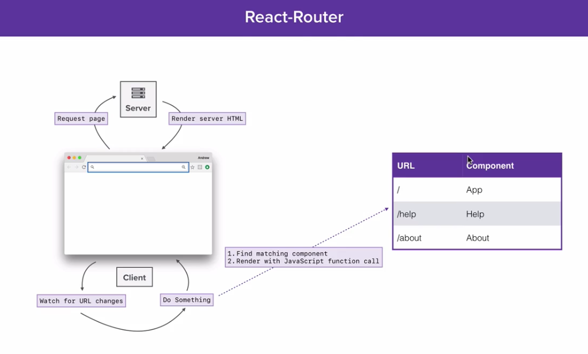
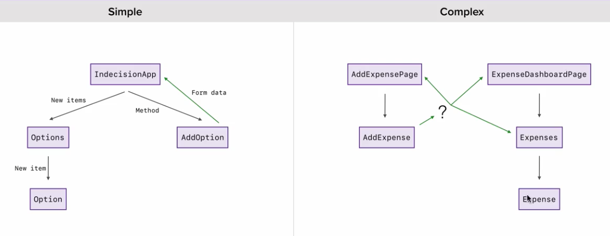
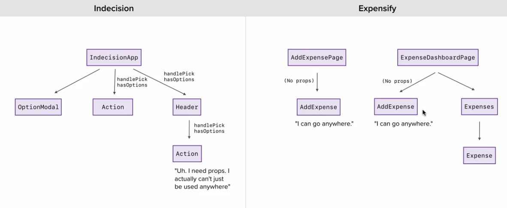
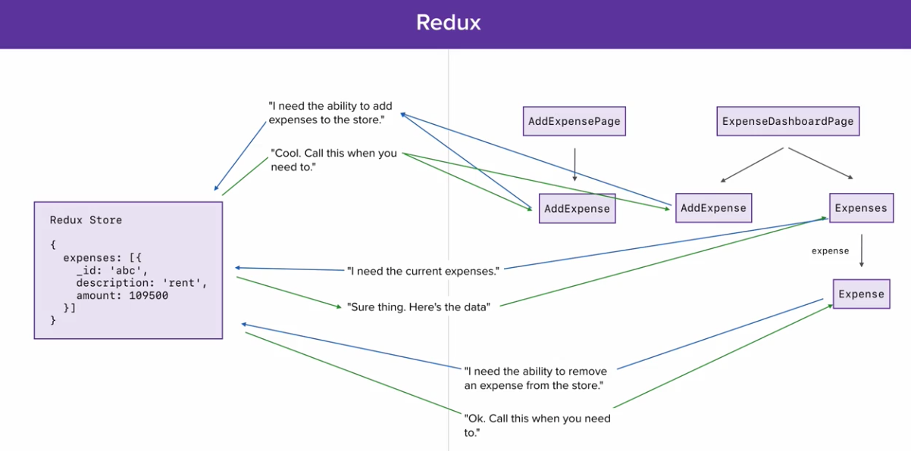

> markdown: https://guides.github.com/features/mastering-markdown/  
> Preview: Chrome extension and QuickLook / space key on the file 

React Course - Udemy - Andrew Mead - Part II
============================================
<!-- TOC -->

- [React Router](#react-router)
  - [Install](#install)
  - [Import](#import)
  - [Use BrowserRouter and Router](#use-browserrouter-and-router)
  - [Webpack Configuration](#webpack-configuration)
  - [Setting Up a 404](#setting-up-a-404)
  - [Linking between Routes](#linking-between-routes)
  - [Static content across pages](#static-content-across-pages)
  - [Navigation panel](#navigation-panel)
  - [Organizing our Routes](#organizing-our-routes)
  - [Query Strings and URL Parameters](#query-strings-and-url-parameters)
- [Redux](#redux)
  - [The issues managing state](#the-issues-managing-state)
  - [How Redux works](#how-redux-works)
  - [Setting up Redux](#setting-up-redux)
  - [Dispatching Actions](#dispatching-actions)
  - [Subscribing and dynamic actions](#subscribing-and-dynamic-actions)
    - [Watch for changes to the store](#watch-for-changes-to-the-store)
    - [How to dispatch an action and pass some data along](#how-to-dispatch-an-action-and-pass-some-data-along)

<!-- /TOC -->

# React Router
- There are differences between server routing and client routing
- Client routing was already popular. React provide its implementation for this pattern
- https://reacttraining.com/react-router/


## Install
- There are specific versions for web development and native. We'll use the web one
  ```
  yarn add react-router-dom
  ```

## Import
  ```javascript
  //app.js
  import { BrowserRouter, Route } from 'react-router-dom'
  ```

## Use BrowserRouter and Router
- By default the routing match is inclusive; so components that matches at least part of the ```path``` attribute will be rendered to the screen. That's the case of **/** which will be rendered alongside the other components because it includes the root. To avoid this we add the prop ```exact={true}``` to the ```Route```
  ```javascript
  const ExpenseDashboardPage = () => (<div>This is from Dashboard component</div>)
  const AddExpensePage = () => (<div>This is from AddExpense component</div>)
  
  const routes = (
    <BrowserRouter>
      <div> // BrowserRouter API only allows 1 child
        <Route path="/" component={ExpenseDashboardPage} exact={true} />
        <Route path="/create" component={AddExpensePage} />
      </div>
    </BrowserRouter>
  );

  ReactDOM.render(routes, document.getElementById('app'))
  ```

## Webpack Configuration
- Browsers by default will try to use server side routing resulting in 404 errors. We need to tweak devServer webpack config to send index.html back for all routes and let react-router figure out what to show in the screen
- Add ```historyApiFallback: true``` to webpack config to tell the devServer to always serve up the index.html file for all unknown 404s
  ```javascript
  devServer: {
    contentBase: path.join(__dirname, 'public') ,
    historyApiFallback: true
  }
  ```
- Restart dev-server every time the webpack config file is updated ```yarn run dev-server```

## Setting Up a 404
- ```Switch``` will go through all the different ```Route``` inside and will stop when it finds a match. The last one always matches and will show up for routes that aren't defined
  ```javascript
  import { BrowserRouter, Route, Switch } from 'react-router-dom'
  const routes = (
    <BrowserRouter>
      <Switch>
        <Route path="/" component={ExpenseDashboardPage} exact={true} />
        <Route path="/create" component={AddExpensePage} />
        <Route path="/edit" component={EditExpensePage} />
        <Route path="/help" component={HelpPage} />
        <Route component={NotFoundPage} />
      </Switch>
    </BrowserRouter>
  );

  ReactDOM.render(routes, document.getElementById('app'))
  ```

## Linking between Routes
- By default the browser is trying server-side routing. So, if we use a regular ```<a href="/">Go home </a>``` to link between pages we'll get a full refresh of the Page. We need to override this browser's default behavior. react-router provides ```<Link>``` and ```<NavLink>``` for us to implement client-side routing and achieve navigation between routes without refreshing the whole page
- By using client routing, Javascript just swaps things out on the fly and makes a new call to react to render the new component
  ```javascript
  import { BrowserRouter, Route, Switch, Link } from 'react-router-dom'
  const NotFoundPage = () => (
    <div>
      404! - <Link to="/">Go home</Link>
    </div>
  );
  ```
- If we change the url directly in the browser's address bar we'll still get full refresh
- If we need to navigate to an external URL, we use regular anchor tags ```<a href="/">ExternalPage</a>```, but if we need to navigate inside our app we use ```<Link to="">```

## Static content across pages
- We can have some static content that appears in all pages regardless the route. eg. Header and Footer. For this, we show the ```Header``` component before the ```Switch```. Remember that ```BrowserRouter``` allows only 1 child, so we go back to using a ```<div>``` root
  ```javascript
  const Header = () => (
    <header>
      <h1>Expensify</h1>
    </header>
  );
  const routes = (
    <BrowserRouter>
      <div>
        <Header />
        <Switch>
          <Route path="/" component={ExpenseDashboardPage} exact={true} />
          <Route path="/create" component={AddExpensePage} />
          <Route component={NotFoundPage} />
        </Switch>
      </div>
    </BrowserRouter>
  );
  ```

## Navigation panel
- react-router provides an alternative to Link, especially for navigation panels, allows by default to highlight the current page ```<NavLink to="">```
- The prop ```to``` follows the same matching rule as Route, so we add the exact parameter
  ```javascript
  const Header = () => (
    <header>
      <h1>Expensify</h1>
      <NavLink to="/" activeClassName="is-active" exact={true}>Dashboard</NavLink>
      <NavLink to="/create" activeClassName="is-active">Create Expense</NavLink>
      <NavLink to="/edit" activeClassName="is-active">Edit Expense</NavLink>
      <NavLink to="/help" activeClassName="is-active">Help</NavLink>
    </header>
  );
  ```
  ```scss
  .is-active {
    font-weight: bold;
    margin-right: 3rem;
    color: orange;
  }
  header a {
    margin-right: 3rem;
  }
  ```
## Organizing our Routes
- Each individual component is better placed inside its own file including Header and NotFoundPage.
  ```javascript
  //file: src/components/NotFoundPage.js
  import React from "react";
  import { Link } from "react-router-dom";

  const NotFoundPage = () => (
    <div>
      404! - <Link to="/">Go home</Link>
    </div>
  );

  export default NotFoundPage

  //file: src/components/AddExpensePage.js
  import React from "react";

  const AddExpensePage = () => (
    <div>
      This is from AddExpense component
    </div>
  );

  export default AddExpensePage
  ```
- The router is also better placed as a functional component in a different folder and in here import all other components
  ```javascript
  //file: src/routes/AppRouter.js
  import React from "react";
  import { BrowserRouter, Route, Switch } from "react-router-dom";
  import Header from '../components/Header'
  import ExpenseDashboardPage from '../components/ExpenseDashboardPage'
  import AddExpensePage from "../components/AddExpensePage";
  import EditExpensePage from "../components/EditExpensePage";
  import HelpPage from "../components/HelpPage";
  import NotFoundPage from "../components/NotFoundPage";

  const AppRouter = () => (
    <BrowserRouter>
      <div>
        <Header />
        <Switch>
          <Route path="/" component={ExpenseDashboardPage} exact={true} />
          <Route path="/create" component={AddExpensePage} />
          <Route path="/edit" component={EditExpensePage} />
          <Route path="/help" component={HelpPage} />
          <Route component={NotFoundPage} />
        </Switch>
      </div>
    </BrowserRouter>
  );

  export default AppRouter
  ```
- app.js remains as a simple file where we render AppRouter component.
  ```javascript
  //file: src/app.js
  import React from 'react'
  import ReactDOM from 'react-dom'
  import AppRouter from './routers/AppRouter'
  import 'normalize.css/normalize.css'
  import './styles/styles.scss'

  ReactDOM.render(<AppRouter />, document.getElementById('app'))
  ```

## Query Strings and URL Parameters
- When react-router finds a route that is a match, it renders an instance of that component. No only is it rendering the component it's also passing a few props down. So anytime we use a component inside a route we get access to some special information.
  - history: things like goBack, goForward, push, replace - allow us to manipulate where the user is directed
  - match: contains param object for dynamic urls
  - location: information about the current url
    ```
    localhost:8080/edit?query=rent&sort=date
    search will bring: ?query=rent&sort=date
    we can also get the hash value
    ```
- Our App will have paths like ```localhost:8080/edit/107``` meaning that we intend to edit the expense with id 107. So we need to be able to set an manipulate these dynamic urls
  - We need to tweak the Route. Add colon ```(:)``` and what comes after is a variable name. This is going to dynamically match whatever comes after the forward slash in the url so that we can do something meaningful with it like fetching the item from the database
    ```javascript
    <Route path="/edit/:id" component={EditExpensePage} />
    ```
  - Now the value in the url (107) comes in the variable **id** under props.match.params

# Redux
- Redux is a state management library that integrates nicely with React
- Allow us to track changing data
- Component's state and redux they both aim to solve the same problem which is to manage the state for your application - tracking changing data
- State is data that changes. For components' state we used ```this.setState``` to change data and ```this.state.value``` to read some value from there

## The issues managing state
- When having complex Apps there's no way to share state across all components
- For Simple Apps we can keep the state in a Parent component but for Complex Apps where to keep the state and how to share it? we don't have a Parent, instead a Router decide which component to show on screen - Complex State is Complex

- Components in Apps like IndecisionApp are closely bound, we break things in Components which is good but the child component need props passed down from the parent so the component can't really be reused wherever we want. We will need then pass down some props to components that don't even need to know about them - Components really aren't reusable
- What we need is a way for components to be able to interact with the application state both getting and setting value without having to manually pass props down to the entire component tree. It would be much nicer if each component could describe what it needs from the state and what it needs to be able to change on this state

- Some questions emerge
  - Where do I store my app state in a complex React app?
  - How do I create components that are actually reusable?
- The response is: use Redux
- There's no wrong using ```props``` it's a perfectly valid way of communicating data between parent and child eg. Options to Option in IndecisionApp or Expenses to Expense in Expensify
- The scenario where we really want to avoid ```props``` is when we're passing props down this long chain of components just to get it to the last one in the chain. The components in between aren't actually using the value, they're just passing it along. In that case we want to avoid using props and we should use something like **Redux** instead

## How Redux works
- Redux is a state container same as our class based components
- There's an object called **Redux Store** we can read and change
- Individual components are gonna be able to determine how they want to read and change the elements on the store


## Setting up Redux
- https://redux.js.org
- Change Webpack to read a different file
  ```javascript
  entry: './src/playground/redux-101.js',
  ```
- Install Redux ```yarn add redux```
- Restart dev server ```yarn run dev-server```
- Create redux state container
  ```javascript
  import { createStore } from 'redux'

  //first parameter is the current state
  //we don't have a constructor function where we can set up the default so we do it inline
  //if there is not current state what's the default object?
  const store = createStore((state = { count: 0 }) => { //current state
    return state
  })

  console.log(store.getState()) //output: {count: 0}
  ```
- We have to pass a function to ```createStore()``` and that function gets called once right away. There's no state the first time redux calls this function so the default state value is used. We then return that and it becomes the new state
- We can fetch the current state using the ```getState()``` method on the store; this get the actual object and we can use the values inside for our purposes eg. render a component etc
- Now, how to increment the count? or how to reset the count to zero? - Actions is the response

## Dispatching Actions
- Actions allow us to change the redux store
- An action is nothing more than an object that gets sent to the store
- This object describes the **type of action** we'd like to take. So we'll have actions like increment, decrement and reset. This is going to allow us to change the store over time by just dispatching various actions
- The object will contain a property ```type``` and the value by convention is all uppercase and underscore if more than one word
- Then we send the object to the store using ```store.dispatch({ my_action_object })```
- When we call ```store.dispatch``` the function ```createStore``` runs for the second time. The action object gets passed as the second argument to the function 
- Then we can use the action type to take action like adding one to the count otherwise it's the first time Redux is running the function and just return the state without change
- Inside the action type checking we return an object with the new state, we shouldn't change the state or action but instead return the new state we use the state values to compute the new state - similar to this.setState
  ```javascript
  import { createStore } from 'redux'

  const store = createStore((state = { count: 0 }, action) => { //current state
    if (action.type === 'INCREMENT') {
      return {
        count: state.count + 1 //return new state object
      }
    } else {
      return state //return state unchanged
    }
  })

  console.log(store.getState()) //output: {count: 0}

  // I'd like to increment the count
  store.dispatch({ //dispatch an action of type INCREMENT to change the store
    type: 'INCREMENT' //uppercase by convention
  })

  console.log(store.getState()) //now state has changed and output is {count: 1}
  ```
- It's a common pattern to use a ```switch``` statement instead of if/else because it's easier to read and scale
  ```javascript
  const store = createStore((state = { count: 0 }, action) => {
    switch (action.type) {
      case 'INCREMENT':
        return {
          count: state.count + 1 //return new state object
        }
      case 'DECREMENT':
        return {
          count: state.count - 1
        }
      case 'RESET':
        return {
          count: 0
        }
      default: //runs if none of the other cases run
        return state; //return state unchanged
    }
  })

  // dispatch actions
  store.dispatch({
    type: 'INCREMENT'
  })
  store.dispatch({
    type: "DECREMENT"
  })
  store.dispatch({
    type: 'RESET'
  })
  ``` 

## Subscribing and dynamic actions

### Watch for changes to the store
- We need to be aware of changes to the store in order to re-render our application or do something of interest to our application
- Redux gives us ```store.subscribe``` and we pass a function that's gonna be called every single time the store changes 
  ```javascript
  store.subscribe(() => {
    console.log(store.getState()) //gets called every time an action is dispatched twice in this case
  })
  store.dispatch({
    type: 'INCREMENT' 
  })
  store.dispatch({
    type: "INCREMENT"
  });
  ```
- We can also remove the subscription by storing the return from subscribe and calling it whenever we want to unsubscribe
  ```javascript
  const unsubscribe = store.subscribe(() => {
    console.log(store.getState()) //gets called only once because we unsubscribe after the first dispatch
  })
  store.dispatch({
    type: 'INCREMENT' 
  })
  unsubscribe()
  store.dispatch({
    type: "INCREMENT"
  });
  ```

### How to dispatch an action and pass some data along 
- We might want to pass some dynamic information to the action for instance user input
- `type` is mandatory in all actions otherwise Redux is going to crash but we can also toss as many additional things as you want
- For instance we might want to pass an **optional** property ```incrementBy``` and consider it in the Action handler. We will have access to this property through action.incrementBy in a similar way as we get access to action.type
  ```javascript
  const store = createStore((state = { count: 0 }, action) => {
    switch (action.type) {
      case 'INCREMENT':
        //if there's a value take it otherwise default it to 1
        const incrementBy = typeof action.incrementBy === 'number' ? action.incrementBy : 1
        return {
          count: state.count + incrementBy 
        }
      default: //runs if none of the other cases run
        return state; //return state unchanged
    }
  })

  store.dispatch({
    type: 'INCREMENT',
    incrementBy: 5 
  })
  store.dispatch({
    type: "INCREMENT"
  });
  ```
- We can also make the additional data **mandatory** by just forcing it to be passed to get the desired data. If not passed we won't have an error but it will be undefined leading to wrong behavior
  ```javascript
  const store = createStore((state = { count: 0 }, action) => {
    switch (action.type) {
      case 'SET':
        return {
          count: action.count
        }
      default: //runs if none of the other cases run
        return state; //return state unchanged
    }
  })
  store.dispatch({
    type: 'SET',
    count: 101
  })
  ```
